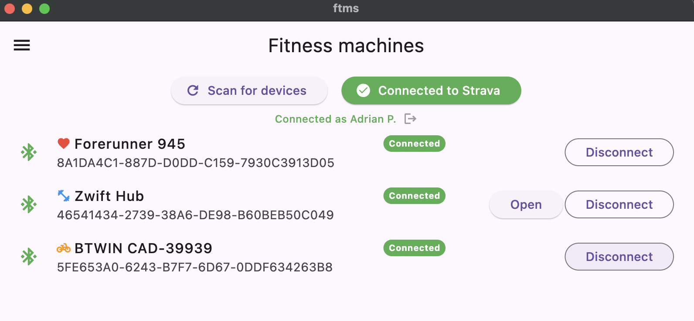
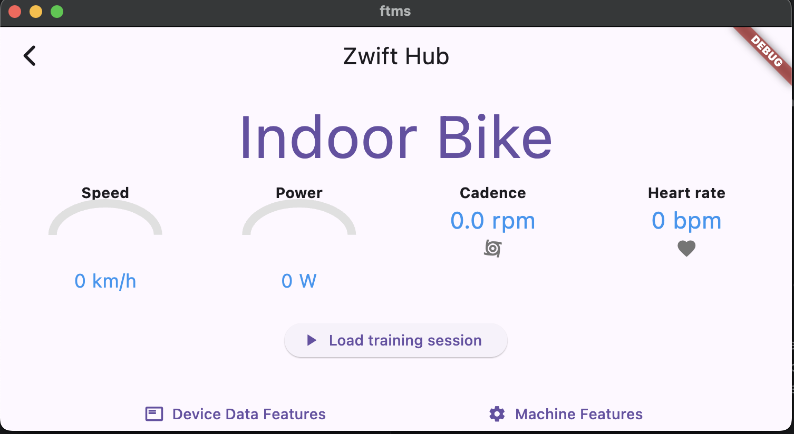
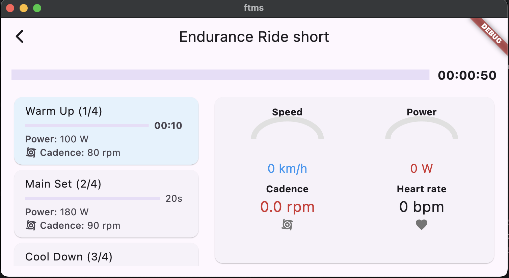
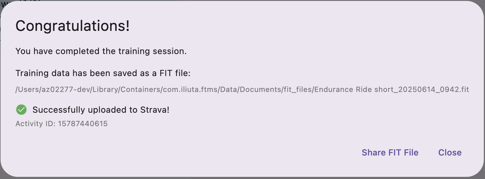
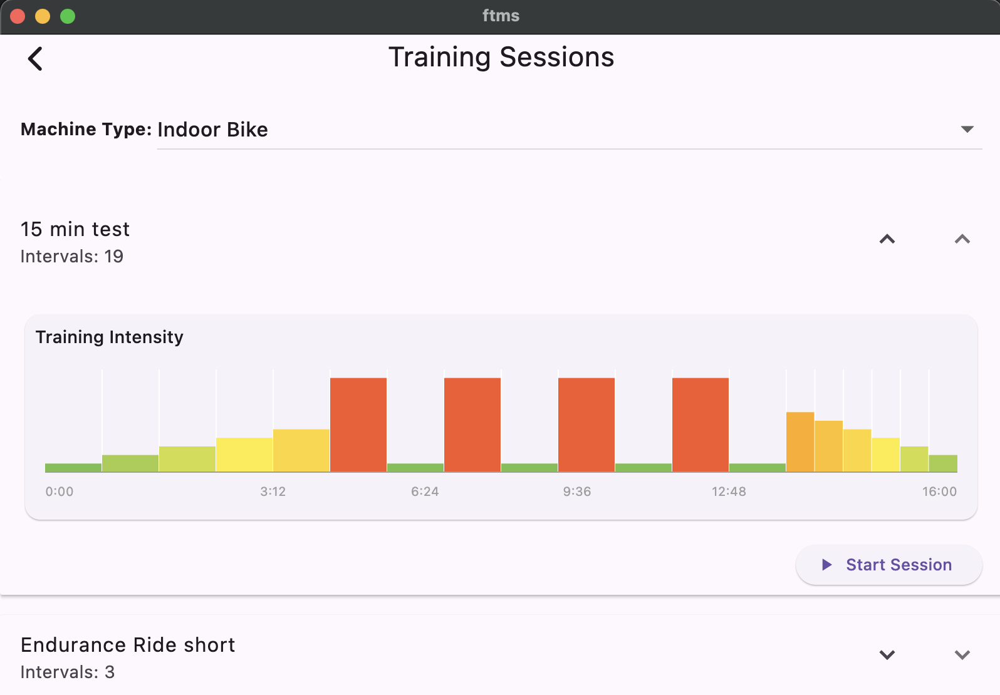

# HEAVY WORK IN PROGRESS

# FTMS Training App

I started this app because I bought a rowing machine :) and the free app I was using didn't have the features I wanted and only worked by setting the trainer resistance: 
- target cadence
- target speed

By chance, the rowing machine supports FTMS protocol.

I also have a Zwift Hub trainer and it's easier to play with it than with the rowing machine because it doesn't go in standby mode after a few minutes of inactivity.

I was looking for a way to learn Flutter and this seemed like a good project to start with.

It is based on flutter_ftms (https://github.com/Malte2036/flutter_ftms), a Flutter package for FTMS Bluetooth connectivity. Nice work, BTW, it saves a lot of time for translating complicated hex bluetooth codes into meaningful, human readable data.

## Screenshots







## Main Features

- **FTMS Bluetooth Connectivity**: scan for and connect to FTMS-compatible fitness machines ( bikes, rowers) using Bluetooth Low Energy (BLE).
- **Heart rate monitoring**: connect to heart rate monitors (HRMs) via Bluetooth and display real-time heart rate data.
- **Live Data Display**: View real-time metrics from your connected machine.
- **Structured Training Sessions**: load and execute interval-based training sessions with support for both simple and grouped intervals.
- **Session Progress Tracking**: Visual progress bar and detailed feedback during workouts, including interval targets and completion status.
- **FIT file generation**: When a training session is over, a FIT file is generated in the application private storage and automatically sent to Strava. 

For build, test, and usage instructions, see the rest of this README.

## Features I'm thinking about

- Control the machine resistance (ERG mode). I tried to implement this but for some reason it doesn't work. I'm still digging into it.
- Training session editor (for the moment, the training sessions are manually defined files in `lib/training-sessions/`)
- User preferences: FTP, max heart rate, etc (hardcoded for the moment)

## Getting Started

### Prerequisites
- [Flutter SDK](https://flutter.dev/docs/get-started/install) 
- Java 21 for Android builds
- Android Studio and/or Xcode for mobile builds (I'm on a Mac M4, I don't really know if it works on other platforms)
- Bluetooth activated on your device

### Install Dependencies
```zsh
flutter pub get
```

### Build and Run

#### Android (on a test phone)
1. Connect your Android device via USB and enable developer mode.
2. Build and install the APK:
   ```zsh
   flutter build apk --release
   flutter run -d <device_id>
   ```
The Android device ID can be found with `flutter devices`. It must be in developer mode.

   ```zsh
   flutter devicces
   flutter install -d <device_id>
   ```

#### macOS
```zsh
flutter run -d macos
```

## Running Tests
```zsh
flutter test
```

## Static Analysis
```zsh
flutter analyze
```

## Continuous Integration
CI is set up with GitHub Actions: see `.github/workflows/flutter_ci.yml` for build, analyze, and test jobs.

## Training Sessions
- Training sessions are defined as JSON files in `lib/training-sessions/`.
- Supports nested intervals (unit/group) and custom targets.

## Permissions
- **Android:** Requires Bluetooth and location permissions (see `AndroidManifest.xml`).
- **macOS/iOS:** Requires Bluetooth permissions in Info.plist.

## License
It's free to fork and use, but please don't use it for commercial purposes without asking me first.
